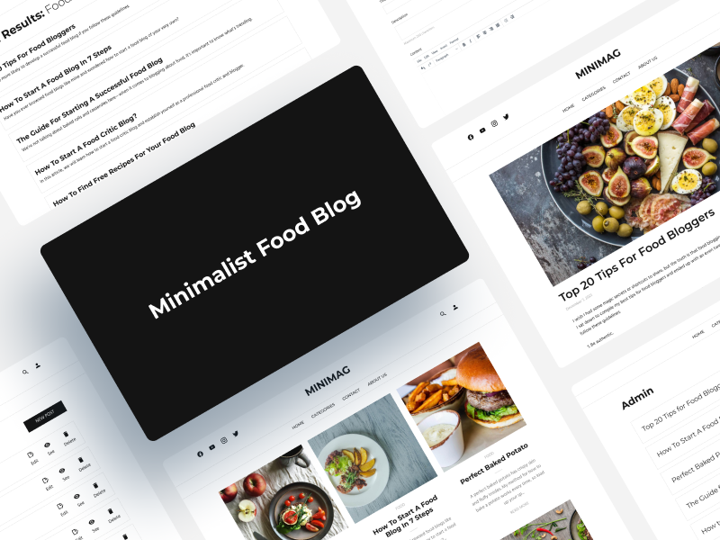

# Minimalist Food Blog

This project is a minimalist-style food blog built with pure PHP 7. It has a login form, and the blog posts save in databases.

I made this project to put my PHP knowledge into practice by replicating the [MiniMag](https://themeforest.net/item/minimag-magazine-and-blog-wordpress-theme/20610004) WordPress theme made by AtiX.

## Table of contents

-   [Overview](#overview)
    -   [Screenshot](#screenshot)
    -   [Links](#links)
-   [My process](#my-process)
    -   [Built with](#built-with)
    -   [What I learned](#what-i-learned)
    -   [Continued development](#continued-development)
    -   [Useful resources](#useful-resources)
-   [Author](#author)
-   [Acknowledgments](#acknowledgments)

## Overview

### Screenshot



### Links

-   Live Site URL: https://foodblog.javieereufracio.com/

## My process

### Built with

-   PHP 7
-   MySQL
-   Semantic HTML5 markup
-   CSS custom properties
-   [Bootstrap 5](https://getbootstrap.com/)
-   [Google Fonts](https://fonts.google.com/)
-   [SASS](https://sass-lang.com/) - CSS Preprocessor
-   [Owl Carousel](https://owlcarousel2.github.io/OwlCarousel2/) - JQuery Plugin
-   [Try TinyMCE](https://www.tiny.cloud/) - Text editor

### What I learned

This is my first complex project with PHP, and I learned a lot about handling files in databases, how to bring information from them to a page, how to present it, and a bit about user authentication for the login part.

Although there are still many details that need to be worked out, I share parts of the code that are part of my learning throughout this project:

```PHP
// save a post with an image in the database.

$title = sanitizeData($_POST['title']);
$info = sanitizeData($_POST['info']);
$content = sanitizeData($_POST['content']);
$thumb = sanitizeData($_FILES['thumb']['tmp_name']);

if (empty($title) || empty($info) || empty($content) || empty($_FILES)) {
    $errors = 'Please capture all fields';
} else {
    // Defines the name of the container that will receive the temporary file
    $temp_file = IMG_DIRECTION . $_FILES['thumb']['name'];

    // Move the temporary file to the container (and it will no longer be temporary)
    move_uploaded_file($thumb, $temp_file);

    $sql =
        'INSERT INTO articles (title, info, content, image)
        VALUES (:title, :info, :content, :thumb)';
    $statement = $conn->prepare($sql);
    $statement->execute(array(
        ":title" => $title,
        ":info" => $info,
        ":content" => $content,
        ":thumb" => $_FILES['thumb']['name']
    ));

    header('Location: admin.php');
}
```

```html
// show a different icon depending on whether you are logged in.

<?php if(!isset($_SESSION['user'])): ?>
<a class="header__icon" href="<?php echo BASE_URL; ?>login.php">
	<i class="fa-fw fas fa-user"></i>
</a>
<?php else: ?>
<a class="header__icon" href="<?php echo BASE_URL; ?>logout.php">
	<i class="fa-fw fas fa-sign-out-alt"></i>
</a>
<?php endif; ?>
```

### Continued development

The project does not have a mobile version yet, but it is in development already.

There are still details on the edition's page for the blog posts that I want to improve. As well as include categories for each one to filter them.

The user's registry can be done only in the database (a page is pending to configure the users from the web).

### Useful resources

-   [CURSO de php desde cero](https://www.youtube.com/watch?v=nCB1gEkRZ1g)
-   [PHP 8 y MYSQL: El Curso Completo, Práctico y Desde Cero ! ](https://www.udemy.com/course/php-y-mysql/)

Both courses have served me to understand the basics of PHP and its integration with databases. This project is the result of implementing both.

## Author

-   Website - https://javieereufracio.com
-   Github - [@Javieer57](https://github.com/Javieer57)
-   Codepen - [@Javieer57](https://codepen.io/Javieer57)
-   Instagram - [@javieer_eufracio](https://www.instagram.com/javieer_wd/)
-   Frontend Mentor - [@Javieer57](https://www.frontendmentor.io/profile/Javieer57)

## Acknowledgments

-   [MiniMag](https://themeforest.net/item/minimag-magazine-and-blog-wordpress-theme/20610004) - Wordpress theme on which this project is based.
